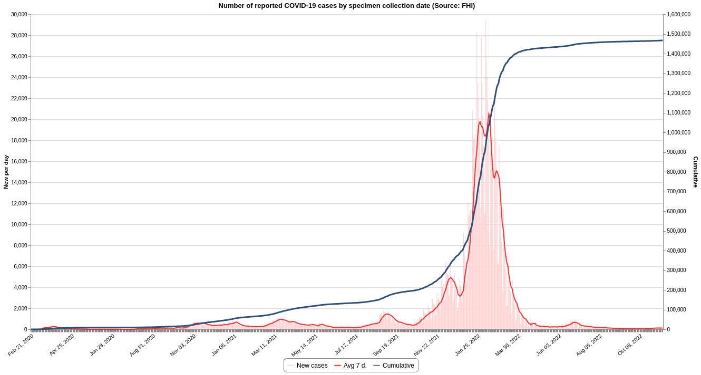
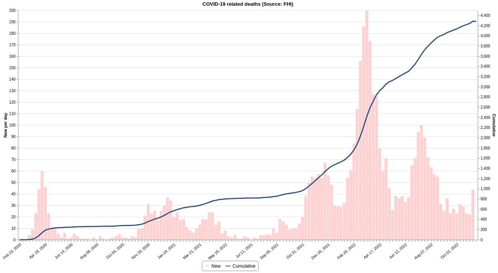
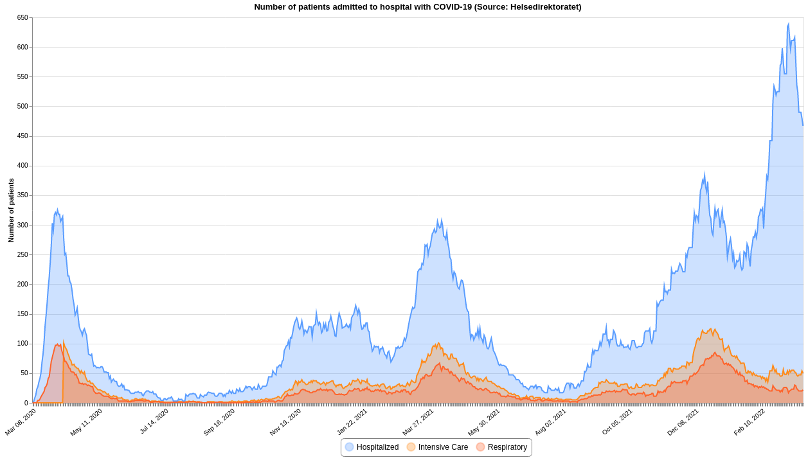
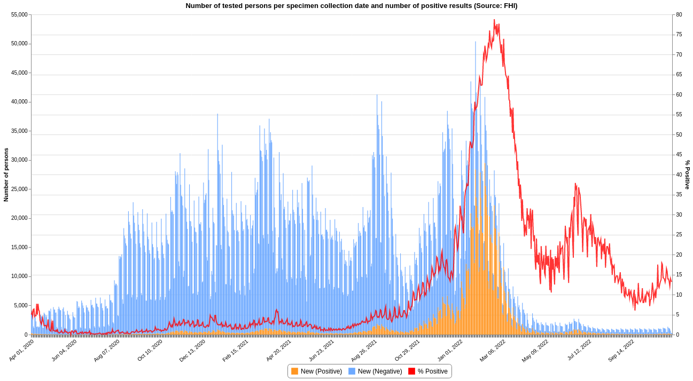
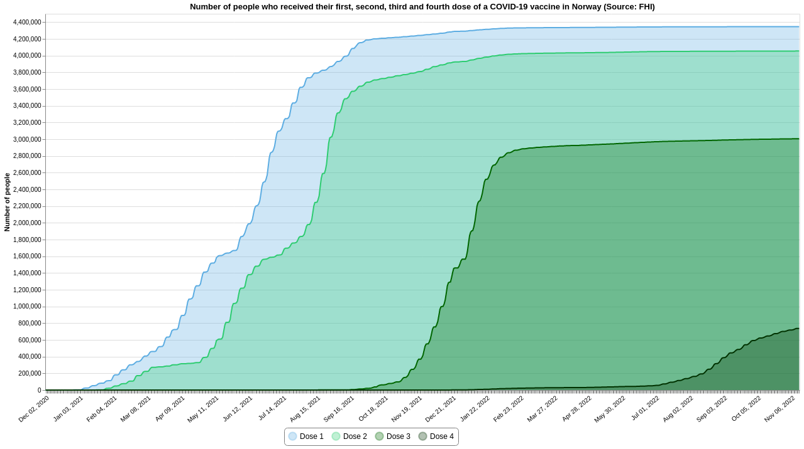
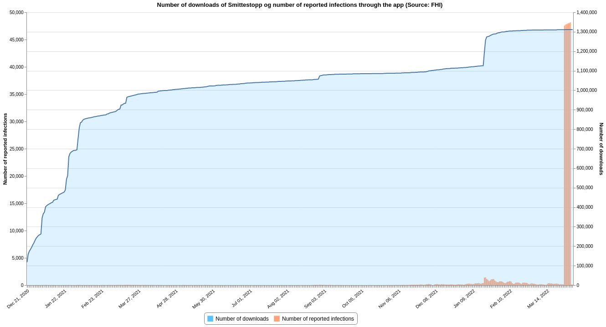

# COVID-19 Datasets for Norway


## Description

This repository contains datasets of daily time-series data related to COVID-19 in Norway.  

## Overview
<!-- table starts -->
|Data|Source|Last updated|Download|Preview|
| :--- | :--- | :--- | :--- | :--- |
|[Confirmed](#confirmedcsv)|FHI / MSIS|2022-02-01 00:20:46+01:00|[<center>csv</center>](https://raw.githubusercontent.com/frefrik/covid19norge-data/main/data/confirmed.csv)|[<center>preview</center>](data/confirmed.csv)|
|[Dead](#deadcsv)|FHI|2022-01-31 13:20:54+01:00|[<center>csv</center>](https://raw.githubusercontent.com/frefrik/covid19norge-data/main/data/dead.csv)|[<center>preview</center>](data/dead.csv)|
|[Hospitalized](#hospitalizedcsv)|Helsedirektoratet|2022-01-31 12:50:54+01:00|[<center>csv</center>](https://raw.githubusercontent.com/frefrik/covid19norge-data/main/data/hospitalized.csv)|[<center>preview</center>](data/hospitalized.csv)|
|[Tested](#testedcsv)|FHI|2022-01-31 13:00:40+01:00|[<center>csv</center>](https://raw.githubusercontent.com/frefrik/covid19norge-data/main/data/tested.csv)|[<center>preview</center>](data/tested.csv)|
|[Tested Lab](#tested_labcsv)|FHI|2022-01-31 13:20:49+01:00|[<center>csv</center>](https://raw.githubusercontent.com/frefrik/covid19norge-data/main/data/tested_lab.csv)|[<center>preview</center>](data/tested_lab.csv)|
|[Transport](#transportcsv)|FHI|2021-09-24 23:10:46+02:00|[<center>csv</center>](https://raw.githubusercontent.com/frefrik/covid19norge-data/main/data/transport.csv)|[<center>preview</center>](data/transport.csv)|
|[Vaccine Doses](#vaccine_dosescsv)|FHI|2022-01-31 13:20:54+01:00|[<center>csv</center>](https://raw.githubusercontent.com/frefrik/covid19norge-data/main/data/vaccine_doses.csv)|[<center>preview</center>](data/vaccine_doses.csv)|
|[Smittestopp](#smittestoppcsv)|FHI|2022-01-31 15:50:51+01:00|[<center>csv</center>](https://raw.githubusercontent.com/frefrik/covid19norge-data/main/data/smittestopp.csv)|[<center>preview</center>](data/smittestopp.csv)|
|[Omicron](#omicroncsv)|FHI|2021-12-22 10:11:05+01:00|[<center>csv</center>](https://raw.githubusercontent.com/frefrik/covid19norge-data/main/data/omicron.csv)|[<center>preview</center>](data/omicron.csv)|
<!-- table ends -->

## Datafiles

### confirmed.csv

Number of cases reported daily in Norway since the start of the epidemic.

**Data source:**

- https://statistikk.fhi.no/msis
- https://github.com/folkehelseinstituttet/surveillance_data

```
date,new,total,source
2020-11-13,687,28807,fhi:git
2020-11-14,366,29173,fhi:git
2020-11-15,259,29432,fhi:git
2020-11-16,78,29510,fhi:git
2020-11-17,239,29749,msis:api
...
```  



---

### dead.csv

Number of COVID-19 associated deaths notified to the Norwegian Institute of Public Health.

**Data source:**

- https://github.com/folkehelseinstituttet/surveillance_data

```
date,new,total,source
2020-11-11,0,285,fhi:git
2020-11-12,6,291,fhi:git
2020-11-13,3,294,fhi:git
2020-11-16,0,294,fhi:git
2020-11-17,4,298,fhi:git
...
```



---

### hospitalized.csv

Number of hospitalized patients.  
The hospitals register the daily number of patients who are admitted to hospital with proven covid-19, how many of these are admitted to the intensive care unit and how many of these receive invasive respiratory treatment. 

**Data source:**

- https://www.helsedirektoratet.no/statistikk/antall-innlagte-pasienter-pa-sykehus-med-pavist-covid-19

```
date,admissions,icu,respiratory,source
2021-12-10,314,108,52,helsedir:api
2021-12-11,307,109,54,helsedir:api
2021-12-12,331,106,58,helsedir:api
2021-12-13,358,109,62,helsedir:api
2021-12-14,363,118,63,helsedir:api
...
```



---

### tested.csv

Number of COVID-19 tests performed.
**Data source:**

- https://www.fhi.no/sv/smittsomme-sykdommer/corona/dags--og-ukerapporter/dags--og-ukerapporter-om-koronavirus/

```
date,new,total,source
2020-11-11,25697,1924640,fhi:web
2020-11-12,27645,1952285,fhi:web
2020-11-13,27145,1979430,fhi:web
2020-11-16,55298,2034728,fhi:web
2020-11-17,16009,2050737,fhi:web
...
```

---

### tested_lab.csv

Number of tested persons per specimen collection date and number of positive results.  
The laboratory results are collected in the MSIS Laboratory Database.

**Data source:**

- https://github.com/folkehelseinstituttet/surveillance_data

```
date,new_neg,new_pos,pr100_pos,new_total,total_neg,total_pos,total,source
2020-11-12,22854,607,2.6,23461,1959573,27657,1987230,fhi:git
2020-11-13,20850,656,3.1,21506,1980423,28313,2008736,fhi:git
2020-11-14,9213,350,3.7,9563,1989636,28663,2018299,fhi:git
2020-11-15,8284,262,3.1,8546,1997920,28925,2026845,fhi:git
2020-11-16,4143,72,1.7,4215,2002063,28997,2031060,fhi:git
...
```



---

### transport.csv

List of departures where persons infected with covid-19 have been on board aircraft, ships, trains and buses.

**Data source:**

- https://www.fhi.no/sv/smittsomme-sykdommer/corona/koronavirus-og-covid-19-pa-offentlig-kommunikasjon/

```
tr_type,route,company,tr_from,tr_to,departure,arrival,source
Fly,SK330,SAS,Oslo,Trondheim,2020-11-16 06:55:00,2020-11-16 07:55:00,fhi:web
Fly,SK1474,SAS,København,Oslo,2020-11-15 22:55:00,,fhi:web
Fly,SK4035,SAS,Oslo,Stavanger,2020-11-15 15:30:00,2020-11-15 16:25:00,fhi:web
Fly,DY620,Norwegian,Oslo,Bergen,2020-11-13 16:29:00,2020-11-13 17:05:00,fhi:web
Fly,SK1320,SAS,Oslo,Ålesund,2020-11-13 13:00:00,2020-11-13 13:55:00,fhi:web
Fly,WF568,Widerøe,Bergen,Kristiansund,2020-11-13 11:00:00,2020-11-13 11:55:00,fhi:web
...
```

---

### vaccine_doses.csv

Number of people who have been vaccinated for COVID-19.

- ```new_dose_1```: Number of people who received their first dose of a COVID-19 vaccine
- ```new_dose_2```: Number of people who received their second dose of a COVID-19 vaccine
- ```total_dose_1```: Cumulative number of people who received their first dose of a COVID-19 vaccine
- ```total_dose_2```: Cumulative number of people who received their second dose of a COVID-19 vaccine
- ```new_doses```: Number of total vaccine doses administered (new_dose_1 + new_dose_2)
- ```total_doses```: Cumulative number of total vaccine doses administered (total_dose_1 + total_dose_2)

**Data source:**

- https://github.com/folkehelseinstituttet/surveillance_data

```
granularity_geo,location_name,date,new_dose_1,new_dose_2,total_dose_1,total_dose_2,total_pr100_dose_1,total_pr100_dose_2,new_doses,total_doses,source
county,Oslo,2020-12-27,5,0,5,0,0.00072098677133472,0.0,5,5,fhi:git
county,Oslo,2020-12-28,264,0,269,0,0.0387890882978079,0.0,264,269,fhi:git
county,Oslo,2020-12-29,118,0,387,0,0.0558043761013073,0.0,118,387,fhi:git
county,Oslo,2020-12-30,58,0,445,0,0.06416782264879001,0.0,58,445,fhi:git
county,Oslo,2020-12-31,5,0,450,0,0.0648888094201248,0.0,5,450,fhi:git
county,Oslo,2021-01-01,6,0,456,0,0.0657539935457264,0.0,6,456,fhi:git
county,Oslo,2021-01-02,0,0,456,0,0.0657539935457264,0.0,0,456,fhi:git
county,Oslo,2021-01-03,0,0,456,0,0.0657539935457264,0.0,0,456,fhi:git
county,Oslo,2021-01-04,0,0,456,0,0.0657539935457264,0.0,0,456,fhi:git
...
```



---

### smittestopp.csv

*Smittestopp is an app from the Norwegian Institute of Public Health ("Folkehelsesinstituttet (FHI)" in Norwegian). The app is intended to help prevent coronavirus from spreading among the population.*

Number of downloads of Smittestopp and the number who have reported through the app that they are infected.

**Data source:**

- https://www.fhi.no/om/smittestopp/nokkeltall-fra-smittestopp/

```
date,new_downloads,total_downloads,new_reported,total_reported,source
2020-12-21,117700,117700,23,23,fhi:web
2020-12-22,41000,158700,18,41,fhi:web
2020-12-23,15600,174300,12,53,fhi:web
2020-12-24,9500,183800,19,72,fhi:web
2020-12-25,10900,194700,10,82,fhi:web
...
```



---

### omicron.csv

Overview of the number of cases of the omicron coronavirus variant in Norway.

*The Norwegian Institute of Public Health will publish information about new cases confirmed by sequencing and update risk assessments if necessary. The time from testing to completion of the sequencing results may vary.*

A confirmed case is a SARS-CoV-2 positive sample that has been found positive for omicron via genome sequencing.

**Data source:**

- https://www.fhi.no/sv/smittsomme-sykdommer/corona/meldte-tilfeller-av-ny-virusvariant/

```
year,week,new_confirmed,total_confirmed,source
2021,47,5,5,fhi:web
2021,48,293,298,fhi:web
2021,49,660,958,fhi:web
...
```
